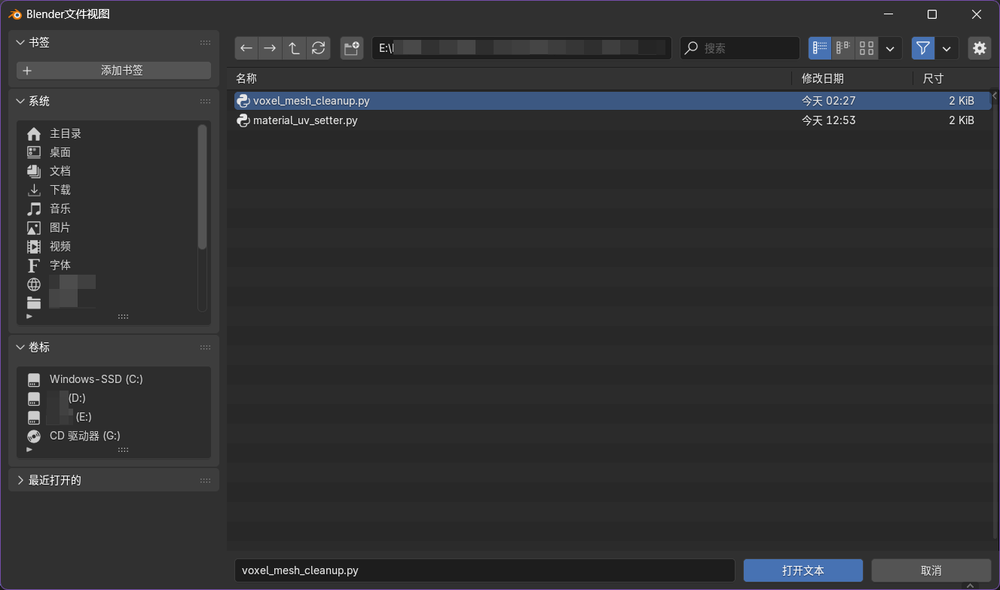
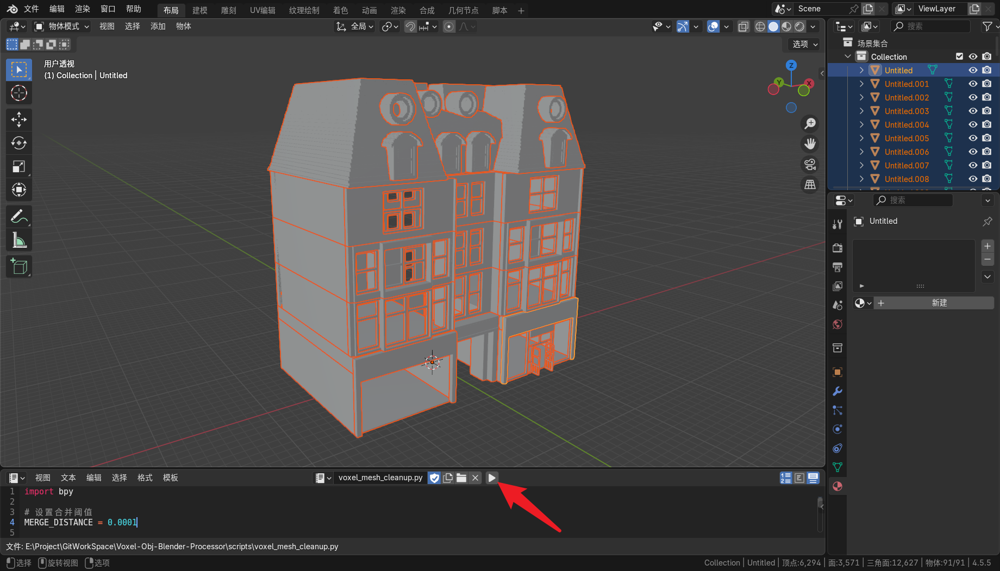

# Voxel-Obj-Blender-Processor-Scripts

这是一个 Blender Python 脚本集合，用于清理和优化从 MagicaVoxel 导出的 .obj 文件。通过自动化网格清理、顶点合并、UV 展开和材质设置等步骤，它能让体素模型更好地适配 Unity 等游戏开发环境

## 使用说明
### 安装方法

1. 下载脚本
2. 在 Blender 中打开“文本编辑器”视图：
  - 选择“打开”
  - 找到并选择下载的脚本文件载入
  - 点击“运行脚本”

### 针对性脚本说明

**mesh_cleaner.py**

- 功能： 对当前场景中所有选中的 Mesh 对象执行清理和优化操作
- 前置准备： 在运行脚本前，选中你想要优化的所有 MagicaVoxel 导入对象

**material_uv_setter.py**

- 功能： 为指定集合中的 Mesh 对象自动展开 UV 并设置材质
- 前置准备：
	- 修改脚本中的两个变量：
		-  `collection_name`：输入你想要处理的集合名称（例如：MyVoxelAssets），该集合下的所有 mesh 将会设置一个统一的材质
		-  `material_name`：输入你想要设置的材质名称（例如：Voxel_Mat_Atlas）。若该材质名存在于缓存数据中，则设置为该材质，否则会新建一个该名称的空材质
	-  确保要处理的 Mesh 对象位于指定的集合中
	-  （可选）修改立方体投影的立方体尺寸：
		-  `CUBE_SIZE`：要设置的立方体投影的立方体尺寸，默认为 5.12（对应的默认情况是使用 512x512 的贴图，每单位像素数为 100）

### 使用示例参考

*****

#### 流程示例

现在已经在 MagicaVoxel 中做好了模型，并导出了 .obj 文件，同时准备好了所需要的贴图 
 
1. 打开 Blender ，导入准备好的 .obj 文件 
 
2. 呼出一个“文本编辑器”区域，替换当前编辑区为“文本编辑器”的快捷键为 `Shift+F11`（或者直接在工作却切换栏中切换到“脚本”工作区），在“文本编辑器”中 选择“打开” 
 
3. 找到下载的`mesh_cleaner.py`脚本并“打开文本” 
 
4. 在“3D视图”中按 `A` 全选所有物体，然后在“文本编辑器”中运行脚本。至此，模型的初始清理完成 
 
5. 下面开始整理工作，把要设置为同一材质的物体都移动到同一集合中，注意命名好方便查找 
 
6. 在“文本编辑器”中 打开另一个脚本`material_uv_setter.py`。在运行脚本前，要先修改脚本中的两个变量 `collection_name` 和 `material_name`，双引号内分别是要处理的集合名称和要设置的材质名称。例如在这个示例中，集合的名称为 `"Wall"`，要设置的材质名为 `"mat_Wall"`，然后运行脚本，由于该示例新建项目并无其它材质，故 Wall 集合中的物体都会被新建一个空的 mat_Wall 材质 
 
7. 呼出“着色器编辑器”区域，导入贴图作为图像纹理，将图像纹理的颜色连上原理化 BSDF 节点的基础色 
 
8. 重复步骤5~7，完成贴图 

*****

#### 处理前后对比

MagicaVoxel 导出的 .obj 模型： 
 
一键清理脚本处理后的模型： 
 

## 注意事项

- 使用 `material_uv_setter.py` 自动展开 uv 可以完美适用于四方连续且无方向限定的贴图，若贴图本身存在方向性，自动立方体投影展开 uv 可能并不完全合适，请根据实际情况按需使用
- `material_uv_setter.py`中自动立方体投影的默认尺寸为 5.12，原因是该尺寸对应的默认情况是使用 512x512 的贴图，每单位像素数为 100。该参数可以根据实际项目需求调整，例如如果您的项目使用 1024x1024 的贴图，每单位像素数为 100，可以修改尺寸为10.24