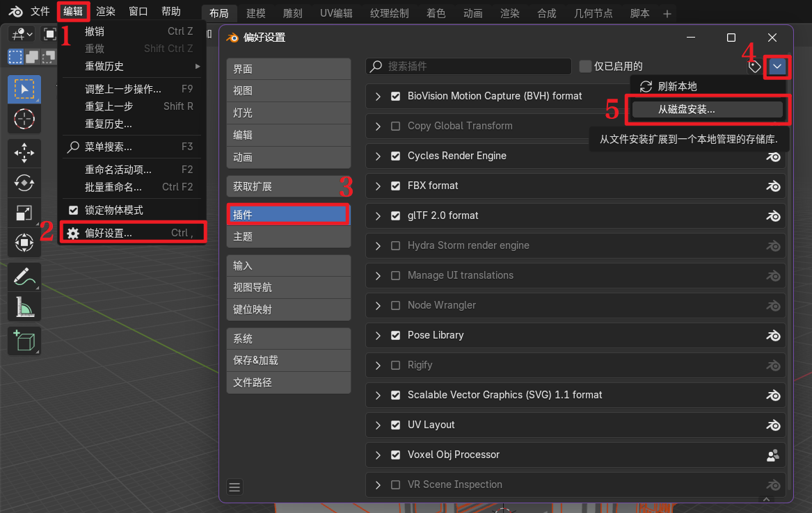
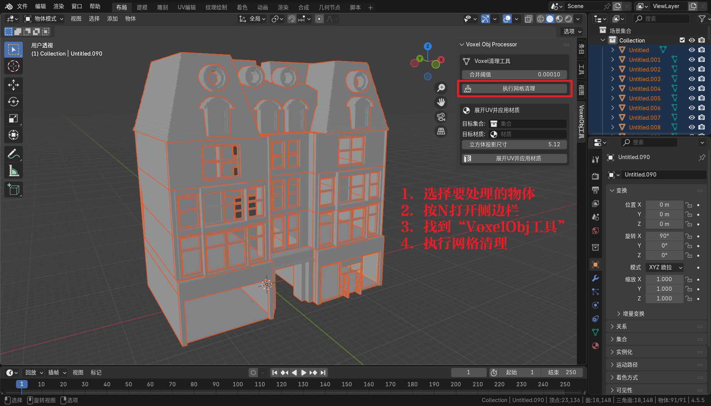
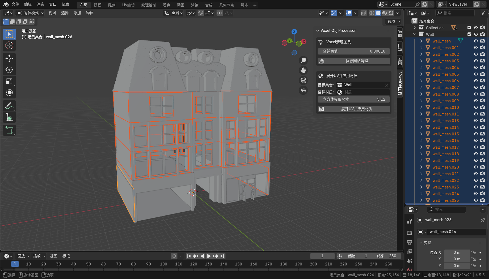
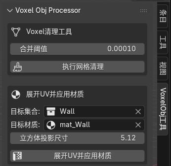
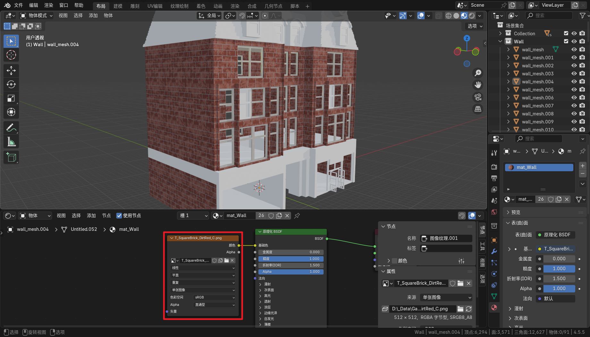

# Voxel-Obj-Blender-Processor-Extension

这是一个 Blender 扩展插件，用于清理和优化从 MagicaVoxel 导出的 .obj 文件。通过自动化网格清理、顶点合并、UV 展开和材质设置等步骤，它能让体素模型更好地适配 Unity 等游戏开发环境

## 使用说明
### 安装方法

1. 下载 .zip 扩展插件
2. 在 Blender 中选择“编辑”  -> “偏好设置...” -> “插件” -> “从磁盘安装...”，找到下载的插件安装

### UI面板说明

快捷键 `N` 打开侧边栏，在 “VoxelObj工具” 找到 UI 面板

**Voxel 清理工具**

- 功能： 对当前场景中所有选中的 Mesh 对象执行清理和优化操作
- 前置准备： 在运行脚本前，选中你想要优化的所有 MagicaVoxel 导入对象

**展开UV并应用材质**

- 功能： 为指定集合中的 Mesh 对象自动展开 UV 并设置材质
- 前置准备：
	- 设置面板中的两个参数：
		-  目标集合：选择你想要处理的集合（例如：MyVoxelAssets），该集合下的所有 mesh 将会设置一个统一的材质
		-  目标材质：选择你想要指定给集合中物体的材质（例如：Voxel_Mat_Atlas）。或者输入一个未存在的新材质名称，则会新建一个该名称的空材质并指定给集合中的物体。如果该项留空，则会自动创建一个前缀为“Mat_” + 集合名称的材质
	-  确保要处理的 Mesh 对象位于指定的集合中
	-  （可选）修改立方体投影的`立方体投影尺寸`：要设置的立方体投影的立方体尺寸，默认为 5.12（对应的默认情况是使用 512x512 的贴图，每单位像素数为 100）

### 使用示例参考

*****

#### 流程示例

现在已经在 MagicaVoxel 中做好了模型，并导出了 .obj 文件，同时准备好了所需要的贴图 
 
1. 打开 Blender ，导入准备好的 .obj 文件 
 
2. 安装下载的扩展 .zip 文件。可以直接拖拽到 Blender 中安装。或者使用传统方式，选择“编辑”  -> “偏好设置...” -> “插件” -> “从磁盘安装...” 
 
3. 在“3D视图”中按 `A` 全选所有物体，然后按`N`，在“VoxelObj工具”中点击"执行网格清理"。至此，模型的初始清理完成 
 
4. 下面开始整理工作，把要设置为同一材质的物体都移动到同一集合中，注意命名好方便查找 
 
5. 在“VoxelObj工具”中设置“目标集合”与“目标材质”。例如在这个示例中，集合的名称为 `"Wall"`，要设置的材质名为 `"mat_Wall"`，点击"展开UV并应用材质" 
 
6. 呼出“着色器编辑器”区域，导入贴图作为图像纹理，将图像纹理的颜色连上原理化 BSDF 节点的基础色 
 
7. 重复步骤4~6，完成贴图 

## 注意事项

- 使用该插件自动展开 uv 可以完美适用于四方连续且无方向限定的贴图，若贴图本身存在方向性，自动立方体投影展开 uv 可能并不完全合适，请根据实际情况按需使用
- “VoxelObj工具”中自动立方体投影的默认尺寸为 5.12，原因是该尺寸对应的默认情况是使用 512x512 的贴图，每单位像素数为 100。该参数可以根据实际项目需求调整，例如如果您的项目使用 1024x1024 的贴图，每单位像素数为 100，可以修改尺寸为10.24