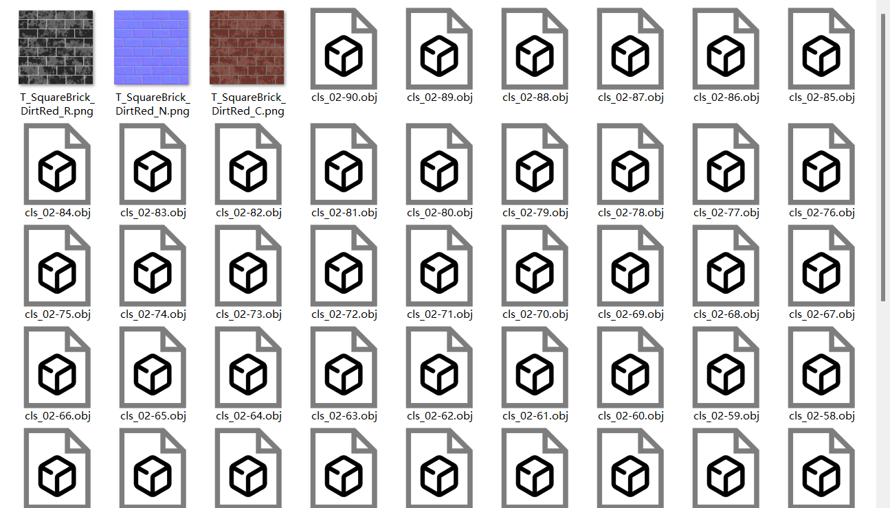
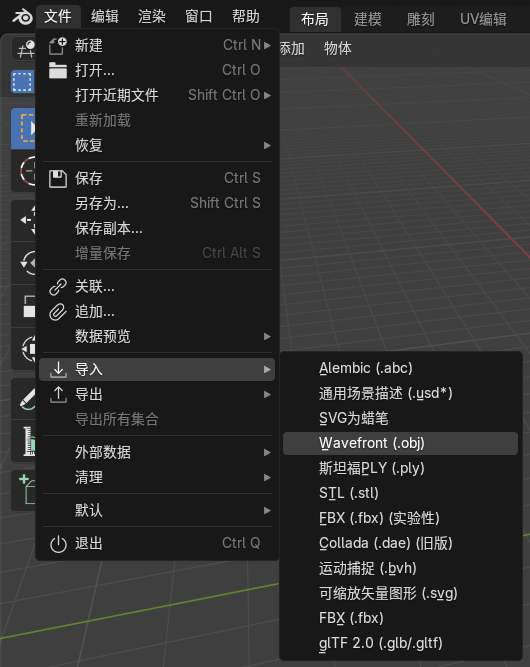
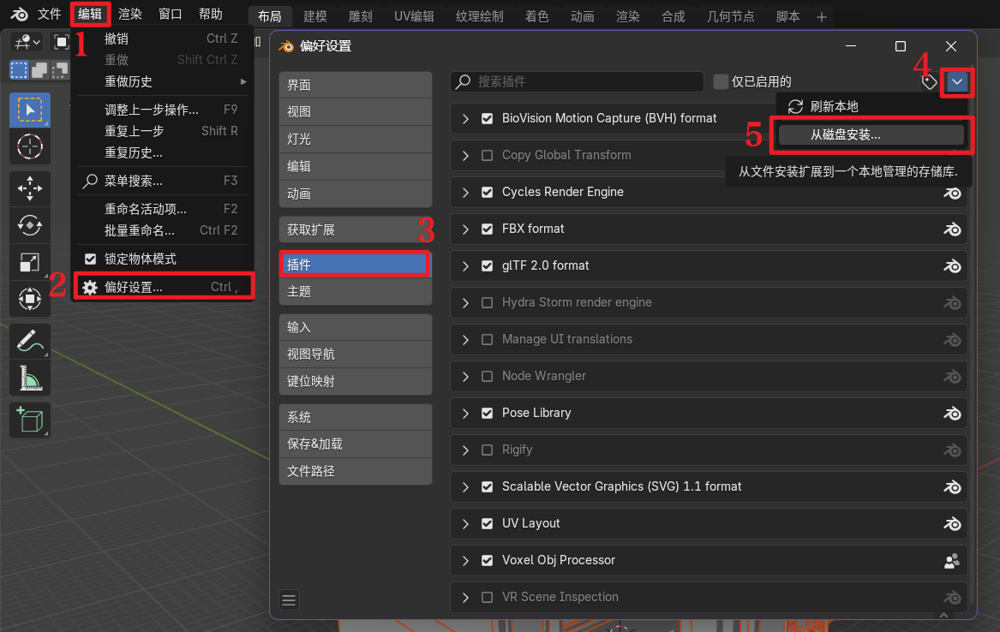
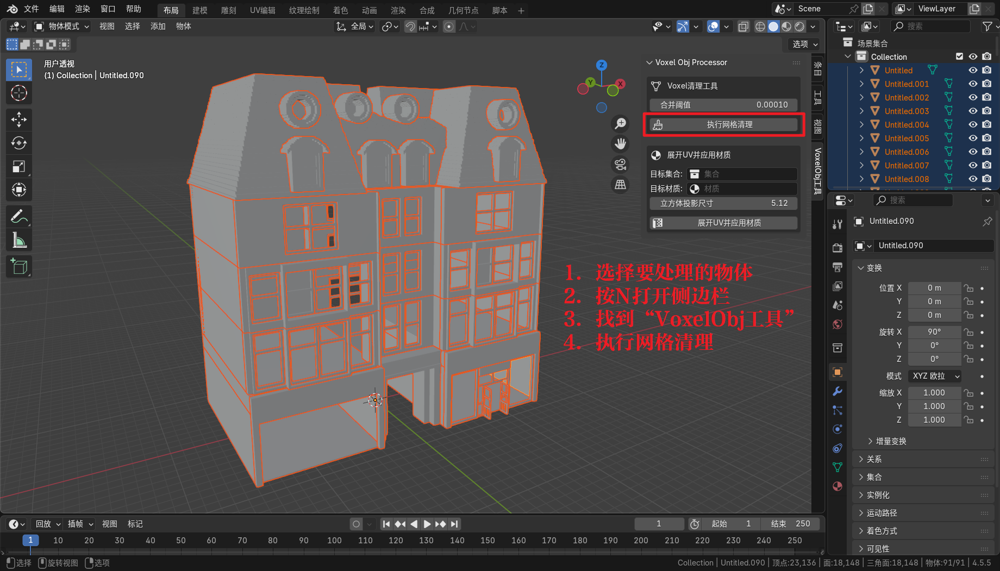
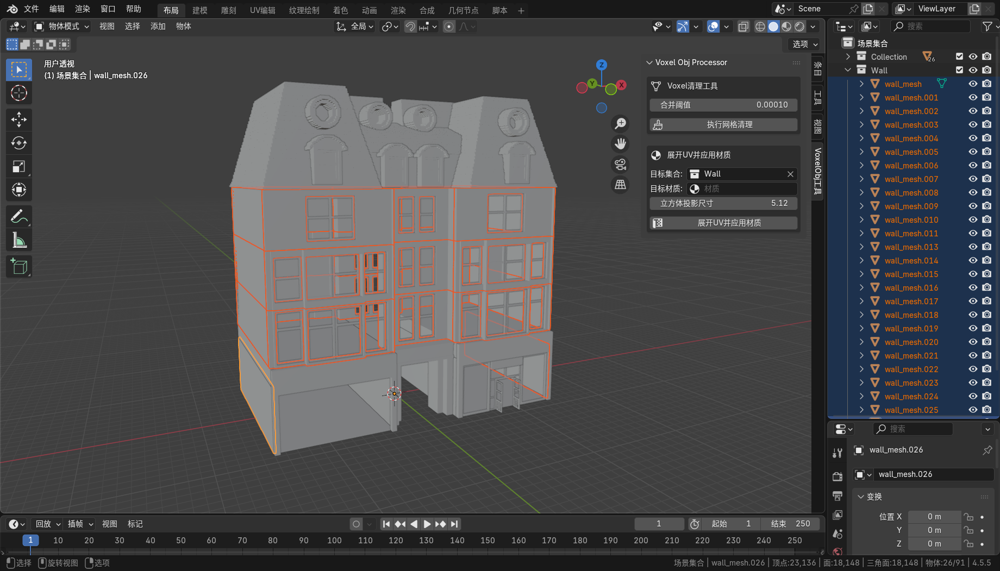
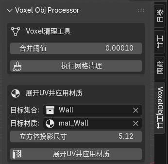
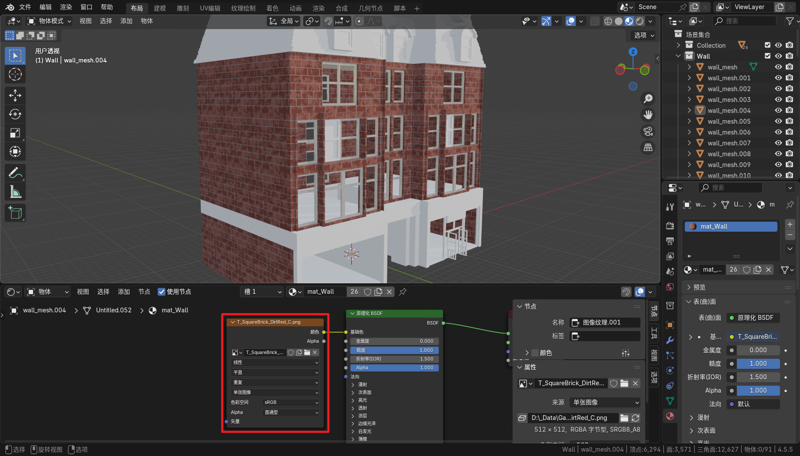

# MagicaVoxel-Blender-Pipeline Extension

这是一个 专为 MagicaVoxel -> Blender -> 游戏引擎 工作流程设计的 Blender Extension。它集成了一系列针对 MagicaVoxel 导出模型的处理工具，可自动完成网格清理、UV 处理、材质整理、贴图处理以及资源导出等操作，帮助模型快速进入 Unity 等游戏开发流程。

## 使用说明
### 安装方法

1. 下载 .zip 扩展插件
2. 在 Blender 中选择“编辑”  -> “偏好设置...” -> “插件” -> “从磁盘安装...”，找到下载的插件安装

### UI面板说明

快捷键 `N` 打开侧边栏，在 “MV Blender Pipeline” 找到 UI 面板

#### Voxel Clean Up 面板

**Voxel 清理工具**

- 功能：对当前场景中所有选中的 Mesh 对象执行清理和优化操作
- 前置准备： 在运行脚本前，选中你想要优化的所有 MagicaVoxel 导入对象

**展开UV并应用材质**

- 功能：为指定集合中的 Mesh 对象自动展开 UV 并设置材质
- 前置准备：
	- 设置面板中的两个参数：
		-  目标集合：选择你想要处理的集合（例如：MyVoxelAssets），该集合下的所有 mesh 将会设置一个统一的材质
		-  目标材质：选择你想要指定给集合中物体的材质（例如：Voxel_Mat_Atlas）。或者输入一个未存在的新材质名称，则会新建一个该名称的空材质并指定给集合中的物体。如果该项留空，则会自动创建一个前缀为“Mat_” + 集合名称的材质
	-  确保要处理的 Mesh 对象位于指定的集合中
	-  （可选）修改立方体投影的`立方体投影尺寸`：要设置的立方体投影的立方体尺寸，默认为 5.12（对应的默认情况是使用 512x512 的贴图，每单位像素数为 100）

#### UV Tools 面板

**应用材质 Tilling 到 UV 缩放**

- 功能：将所有物体材质中 Mapping 节点中的 UV Scale 烘焙到物体的实际 UV 缩放，断开 Mapping 节点的连线
- 适用情况：对于要导入游戏引擎的静态模型，尽可能的保持贴图的 Tilling 为1，如果需要缩放，那么应该对 UV 进行缩放而不是在材质中设置 Tilling，这样在实际游戏引擎中可以减少材质数同时减少不必要的再设置材质参数的步骤，对于这种情况使用该功能一键将所有物体材质中 Mapping 节点中的 UV Scale 烘焙到物体的实际 UV 缩放

#### Material Tools 面板

**根据贴图重命名材质**

- 功能：将所有物体材质根据贴图的名称重命名，例如名称为主贴图名为 T_Wood_BaseMap 的材质将会自动重命名为 M_Wood
- 适用情况：模型最终的规范要求材质槽命名需要符合规范，且与贴图的命名可以按照规则匹配，方便后续导入游戏引擎时可以采用自动化脚本进行引用。故这里采取根据贴图名自动重命名材质的方式，只要保证贴图命名规范，自动处理后材质名也可以保持规范

**修复重复材质(.001)**

- 功能：删除重复的.001等后缀材质，并将所引用的物体材质连接到正确的材质
- 适用情况：
	- 在 blender 重复制材质会有 .001 等后缀，这也是不符合导入游戏引擎规范的，这种情况需要修复删除多余材质
	- 如果上面应用了 Mapping 节点中 UV Scale 到模型 UV 中，对这些原来使用了同样贴图的不同的材质，现在其实变成了参数完全一样的材质，这种情况下需要对这些重复材质进行合并，可以使用该功能一键处理

#### Export Tools 面板

**按集合导出.FBX文件**

- 功能：按照集合一键导出 .fbx 文件，一个集合导出一个 .fbx 文件

### 使用示例参考

*****

#### 处理 MagicaVoxel 导出的 .obj 模型清理流程示例

现在已经在 MagicaVoxel 中做好了模型，并导出了 .obj 文件，同时准备好了所需要的贴图 
 
1. 打开 Blender ，导入准备好的 .obj 文件 
 
2. 安装下载的扩展 .zip 文件。可以直接拖拽到 Blender 中安装。或者使用传统方式，选择“编辑”  -> “偏好设置...” -> “插件” -> “从磁盘安装...” 
 
3. 在“3D视图”中按 `A` 全选所有物体，然后按`N`，在“VoxelObj工具”中点击"执行网格清理"。至此，模型的初始清理完成 
 
4. 下面开始整理工作，把要设置为同一材质的物体都移动到同一集合中，注意命名好方便查找 
 
5. 在“VoxelObj工具”中设置“目标集合”与“目标材质”。例如在这个示例中，集合的名称为 `"Wall"`，要设置的材质名为 `"mat_Wall"`，点击"展开UV并应用材质" 
 
6. 呼出“着色器编辑器”区域，导入贴图作为图像纹理，将图像纹理的颜色连上原理化 BSDF 节点的基础色 
 
7. 重复步骤4~6，完成贴图 

## 注意事项

- 使用该插件自动展开 uv 可以完美适用于四方连续且无方向限定的贴图，若贴图本身存在方向性，自动立方体投影展开 uv 可能并不完全合适，请根据实际情况按需使用
- Voxel Clean Up 面板中的“展开UV并应用材质”自动立方体投影的默认尺寸为 5.12，原因是该尺寸对应的默认情况是使用 512x512 的贴图，每单位像素数为 100。该参数可以根据实际项目需求调整，例如如果您的项目使用 1024x1024 的贴图，每单位像素数为 100，可以修改尺寸为10.24